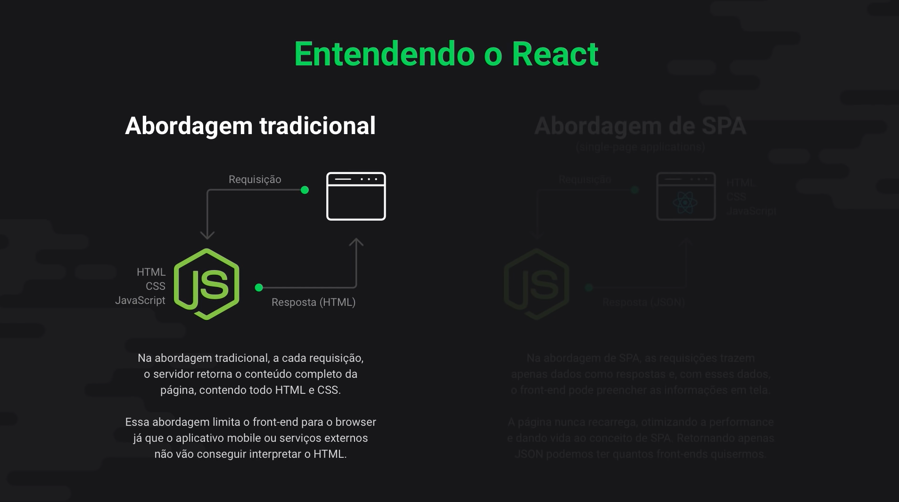
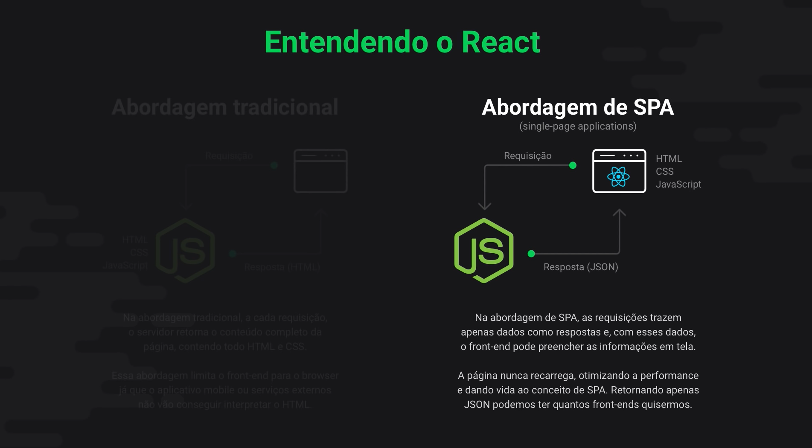

# ANOTACOES DO FRONTEDN






## CRIANDO O AMBIENTE FRONT-END

Para criar um projeto react e um pouco diferente de como criar o node, nos nao usamos o mkdir, usamos uma ferramente propria do react que ajuda a startar o projeto utilizando o  react, afinal o react tem muitas dependencias ja que vem com ele. ai para nao ter que instalar varias dependencias podemos usar esse metodo criado pelo FACEBOOK.


``` yarn create react-app (nome da pasta) ```

fica assim:

``` yarn create react-app web ```


Caso de erro pode tentar o:

```npx create-react-app web```


Caso queira usar o yarn para instalar basta apeas seguir esse processo:

Primeiramente é necessário realizar a instalar do create-react-app. Você chegou a fazer isso? Caso não, basta realizar o comando em seu terminal:

```$ yarn global add create-react-app```
Após isso basta você chamar o create-react-app:

```$ create-react-app meu_projeto```


## PARA INICIALIZAR O PROJETO REACT 

```$ yarn start``


## JSX 

quando olhamos o index.js obeservamos o a tag  ``` <app/> ```

ou seja isso chama JSX que e JavaScript + HTML


ou seja sempre que tiver abertura e fechamento de tag devemos importar o React


## TRES PRINCIPAIS CONCEITOS DO REACT

 **- Componente:**  O componete ele e uma funcao que retorna um HTML ou CSS ou JS de interface. Quando que sabe quando cria um componentes novo quando voce ta repetindo um de novo ou isolar um pedaco da aplicacao dentro de algo que nao atinja infrinja em nenhum dos restantes componentes. 

 ou seja Bloco isolado de HTML, CSS e JS o qual nao interfere no restante da aplicacao

 **- Estado:** Informacoes de que um componete PAI passa para o  componente Filho

 **- Propriedade:** Informacoes mantidas pelo componente (lembrar: Imutabilidade)

 obs 42min da aula explicando os conceitos basicos