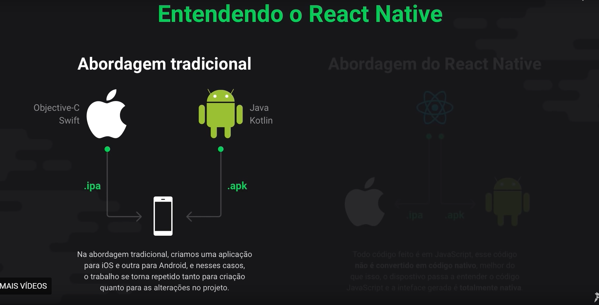

# MOBILE DESENVOLVIMENTO





codigo sem o expo


Codigo com expoÇ


REALIZANDO A INSTALACAO DO EXPO:

``` $ yarn global add expo-cli ``` 

No yarn temos que fazer uma configuracao a mais, porem no windows ele ja vem por padrao 


[YarnGlobal](https://yarnpkg.com/lang/en/docs/cli/global/)

para nao precisar digitar global quando for instalar os pacotes dele, ou seja adiciona os pacotes global ao pacores que o SO encontra de forma global


apos instalar o expo, vamos iniciar o projeto mobile


``` $ expo init mobile ```


Para iniciar o expo 


``` yarn start ```


## Diferenca entre o Reacjs e o Reactnative

A principal diferenca, e como contruimos nossa interface no reactjs usamos o HTML ja do reactNative eles nao tem significado semantico, exemplo se voce coloca um h1 o reactjs ele ira interpretar como um titulo ja no reactnative nao existem tags semanticas que signigica alguma coisa. E tambem elas nao tem estilizacoes proprias todo texto no reactnative tem o mesmo tamanho onde controlamos isso atraves do CSS.

Como funciona a estilizacao no projeto reactnative. nao exitem classes e nem Ids usamos em todos os componetes do reactnative usamos o componente style que recebe um obejto com variavel contendo a estilizacao do elemento.

O CSS no Reactnative ano existe ifem ou seja todos os lugares que tem infen remove e a primeira letra fica maiuscula e todo texto da propriedade colocamos como uma string e usamos virgula e nao ponto e virgula porque e um objeto JS


uma coisa difetente tambem que no reactnative nao existe estilizacao por heranca ou seja cada elemetno contem uma estilizacao especifica.


## ACESSAR A DOCUMENTACAO DO EXPO

Acessa a documentacao do expo para olhar a parte da localizacao

para acessar a documentacao do expo basta voce ir ao site

[Documentacao Expo](https://docs.expo.io/versions/latest/)

[Documentacao Expo Navigation](https://docs.expo.io/versions/v36.0.0/guides/routing-and-navigation/)

dentro da documentacao tem como instalar via iran e add a libs do navigat


e nesse projeto instalamos a navegacao por pilha que e a mais comum ``` yarn add react-navigation-stack  ```

Ela a navegacao que clica e vai a algum lugar e erc


## RECARREGAR O EXPO NO CELULAR

Se voce estuver usando o celular  e so chaqualart


## MAPA COM EXPO

Para adicionar o mapa temos que seguir a documentacao aba mapviw 


## para mostrar o usauario usa a propriedade webviw

que esta na documentacao do expp